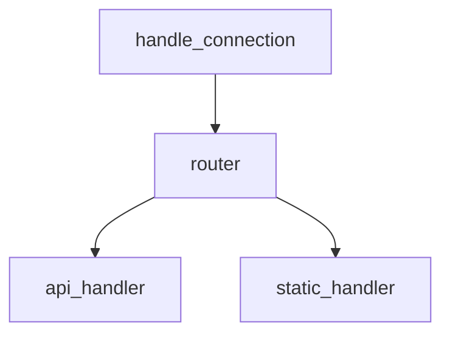
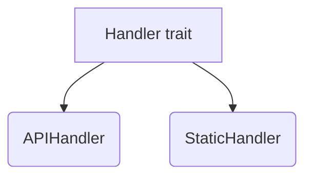

## Router设计
### 数据流

```mermaid
graph TD
  a[handle_connection] --> A[router]
  A[router] --> B[api_handler]
  A[router] --> C[static_handler]
```

### 创建Handler类型

```mermaid
graph TD
  a[Handler trait] --> b(APIHandler)
  a[Handler trait] --> c(StaticHandler)
  
```
1. 为类型实现Handler trait
2. 在src/main.rs的router_init()函数中进行注册