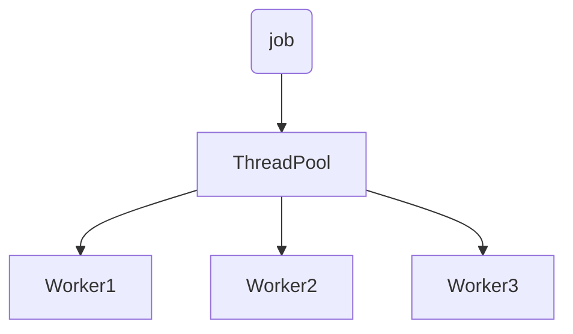
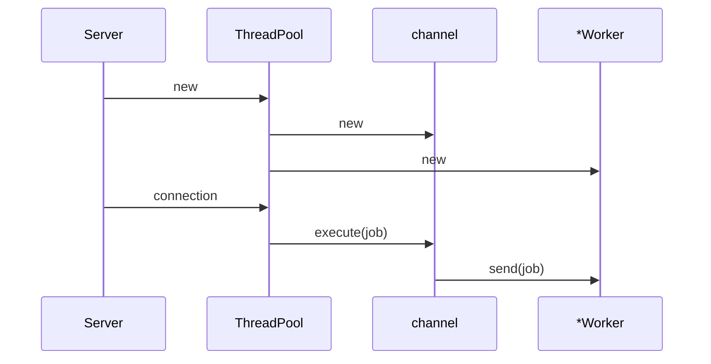

## thread_pool设计
### 数据流

```mermaid
graph TD
  A(job) --> 
  a[ThreadPool] --> b[Worker1]
  a[ThreadPool] --> c[Worker2]
  a[ThreadPool] --> d[Worker3]
```

### 时序图

```mermaid
sequenceDiagram
  Server ->> ThreadPool: new
  ThreadPool ->> channel: new
  ThreadPool ->> *Worker: new
  Server ->> ThreadPool: connection
  ThreadPool ->> channel: execute(job)
  channel ->> *Worker: send(job)
```

